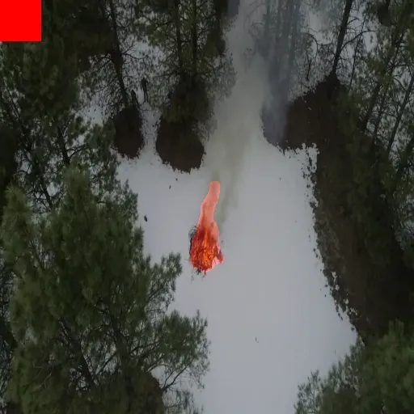

# Introduction

## **Topic: Wildfire Detection and Alert System Using Drones**

Wildfires are becoming increasingly frequent and destructive, causing severe environmental and economic damage. Early detection plays a crucial role in minimizing these impacts, but traditional approaches such as ground-based sensors and satellite imagery often suffer from delayed detection, low resolution, and limited coverage in remote or mountainous areas.

This project introduces a **drone-based wildfire detection system** that integrates **RGB and thermal imagery** with a **deep learning-based semantic segmentation model** to accurately identify fire-affected regions. Additionally, **GPS data** is used to pinpoint the exact location of detected wildfires, providing valuable information for emergency response teams.

Although currently a **proof-of-concept**, this system demonstrates the potential of combining **UAV mobility** and **AI technologies** to enable real-time, scalable wildfire monitoring. It represents a step toward proactive and efficient disaster management solutions.

--- 

## **Demo Video Link**  
[🔗 Click here to view the demo](https://drive.google.com/file/d/1_D1YMSbq7Xcq4Uswqty6oeSK3VbdtsqR/view?usp=sharing)



<summary>Description</summary>

- **[Gradio_Host](gradio_flame.py)** 

Used to host an interactive web based for users to upload videos. Output a video stream with mask overlay. A table of is also shown as an demonstration of alerts being sent back in real-time (value are randomly generated for the sake of demo)

- **[Training Script](training_script.ipynb)**

Contains the code needed to train model. All training configurations can also be found there.

- **[Evaluation](training_results.ipynb)**

The trained model is then used to infer of a test set (10%) for further evaluations. Metrics concerning 4 different training methods can be found at the bottom.

- ** [Models List](trained_models/)

Containing all of the checkpoint of trained model. Each name tells clearly which configurations were used.

## Usage

1. **Launch the web app**
  ```python
  python gradio_flame.py

2. **Open** http://localhost in your browser
3. **Upload** a video file to see results

